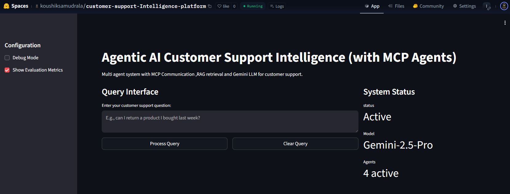
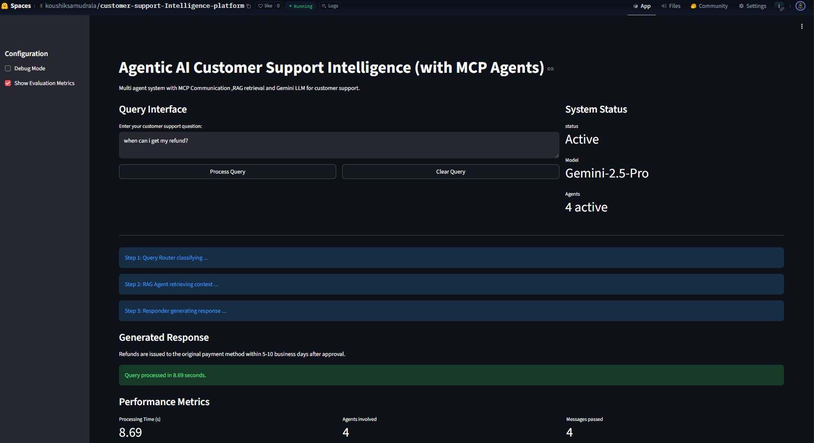

# Agentic AI Customer Support Intelligence Platform
Portfolio Project by **Koushik Samudrala**







🔗 **Live Demo on Hugging Face Spaces**

---

## 🚀 Overview
This project is a production-ready, multi-agent customer support AI platform built as a modular and scalable demonstrator for agentic AI architecture. It showcases explicit MCP-style (Model Context Protocol) agent communication, cutting-edge retrieval augmented generation (RAG), advanced LLM integration (Gemini API), and state-of-the-art orchestration—all designed and deployed.

### Key Specialties
- Custom multi-agent system using explicit message-passing (no direct function calls)
- RAG pipeline for document retrieval: semantic search, hybrid retrieval, vector database
- Knowledge graph-driven reasoning integrated in agent flow
- LLM-powered response generation via Google Gemini API (free, scalable, zero credit card)
- Enterprise-grade streaming UI with Streamlit
- Fully containerized and deployed to Hugging Face Spaces for cloud access

---

## 🌟 Features and Specialities

### 1. Agentic Architecture (MCP)
- Explicit agent-to-agent messaging via a central bus (MCP)
- Separation of agent concerns: QueryRouter, RAGAgent, KGAgent, ResponderAgent, EvaluatorAgent
- Easily extend/replace individual agents for new business logic

### 2. Retrieval Augmented Generation (RAG)
- Hybrid retrieval using HuggingFace all-MiniLM-L6-v2 semantic embeddings and Chroma
- Reusable chunking and document splitting for real-world support scenarios
- Fast, on-device and scalable knowledge base search

### 3. Knowledge Graph Integration
- NetworkX-powered domain graph for product, policy, and entity relationships
- Agents leverage graph queries to link context, resolve ambiguity, and ensure responses are fact-grounded

### 4. LLM Integration: Google Gemini API
- Gemini Pro API for smart, professional response generation
- Free tier usage (no credit card) for easy experimentation
- Prompt engineering controls: classification, context, role-specific instructions

### 5. Robust Evaluation Framework
- Simple and extensible agent for response evaluation (relevance, quality, hallucination risk, source grounding)
- History tracking for continuous agent improvement

### 6. Streamlit UI
- Modern, responsive dashboard for user interaction
- Real-time visualization of agent processing steps, performance metrics, debug logs
- Single command deployment for local or cloud-hosted demos

### 7. Enterprise-Ready Deployment
- Containerized for Hugging Face Spaces (cloud, shareable, scalable)
- YAML-configured README for automatic provisioning
- Secure secrets management for API keys

---

## 🛠️ Tools & Technologies
- **Python 3.10+** – Full-stack implementation language
- **LangChain** – Framework for multi-agent and RAG orchestration
- **ChromaDB** – Scalable, fast vector search database
- **NetworkX** – Knowledge graph construction, entity relationships
- **Streamlit** – Professional web app UI with dashboarding
- **Google Gemini API (langchain-google-genai)** – LLM-powered response
- **dotenv** – Environment variable management for secrets
- **Hugging Face Spaces** – Free, cloud-native hosting & deployment
- **Git** – Source control and deployment pipeline

---

## 📖 Complete Step-by-Step Implementation Guide

### Step 1: Clone the Project
```bash
git clone https://huggingface.co/spaces/koushiksamudrala/customer-support-Intelligence-platform
cd customer-support-Intelligence-platform
```

### Step 2: Set up the Python Environment
```bash
python -m venv venv
source venv/bin/activate          # On Mac/Linux
venv\\Scripts\\activate           # On Windows
```

### Step 3: Install All Dependencies
```bash
pip install -r requirements.txt
```

### Step 4: Configure API Keys
Create a .env file in your project directory:
```bash
GOOGLE_API_KEY=your_gemini_api_key
```
Sign up and get your free API key at Google AI Studio.

### Step 5: Run Locally (Streamlit UI)
```bash
streamlit run app.py
```
Your app will be available at http://localhost:8501

### Step 6: Try Example Questions

- "Can I return my order?"

- "How long does shipping take?"

-  "What's your refund policy?"

-  "Is there a warranty?"

###  Step 7:  Automated Test (Optional)
```bash
python tests/test_system.py
```

### Step 8: Deploy to Hugging Face Spaces (Cloud)

A. Web Interface

  Go to Hugging Face Spaces → Create Space

  Set SDK to streamlit, App file to app.py

  Upload all scripts, README.md, requirements.txt, .env.example

B. Git Push
```bash
huggingface-cli login
git remote add origin [your-space-git-url]
git add .
git commit -m "Initial commit"
git push -u origin main
```

C. Add API Secret

Go to Settings → Repository secrets and add:
```bash
Name: GOOGLE_API_KEY
Value: your_gemini_api_key
```

D. Wait for Build, Test UI

## 📂 Project Structure
```bash
customer-support-Intelligence-platform/
├── mcplib.py             # MCP message bus for agent comms
├── agents.py             # All agent logic (message-driven)
├── rag_pipeline.py       # RAG chunking, embedding, and retrieval
├── knowledge_graph.py    # Knowledge graph definition and access
├── evaluation.py         # Response quality and risk assessment
├── config.py             # All settings in one place
├── app.py                # Streamlit user interface
├── requirements.txt      # Dependency manifest for pip
├── .env.example          # Secrets template
└── tests/
     └── test_system.py   # Automated agent QA
```

### 💡 Notable Achievements

- Multi-agent orchestration via explicit messaging for auditability and scalability
  
-  Zero credit card required, $0 cloud cost for demo and production deployment
  
-  Professional UI and deployment pipeline for instant sharing and usage
  
-  Extensible architecture: Swap agent logic, add new integrations, scale to new domains with minimal effort
  
-  Prompt engineering and API integration: Real-world chatbot reliability

### 📚 Additional Learning Resources

 - LangChain Documentation
  
 - Google Gemini API Docs
  
 - Streamlit Docs
  
 - ChromaDB
  
 - Hugging Face Spaces
  
 - NetworkX 

### 📣 Contact

Created by: Koushik Samudrala

LinkedIn: linkedin.com/in/koushiksamudrala

Space: Customer Support Intelligence Platform


### ⚡ Ready to try?

Fork or clone the project, get your Gemini API key, and experience agentic AI customer support—at the cutting edge of enterprise AI research and engineering!
"""
  


  
